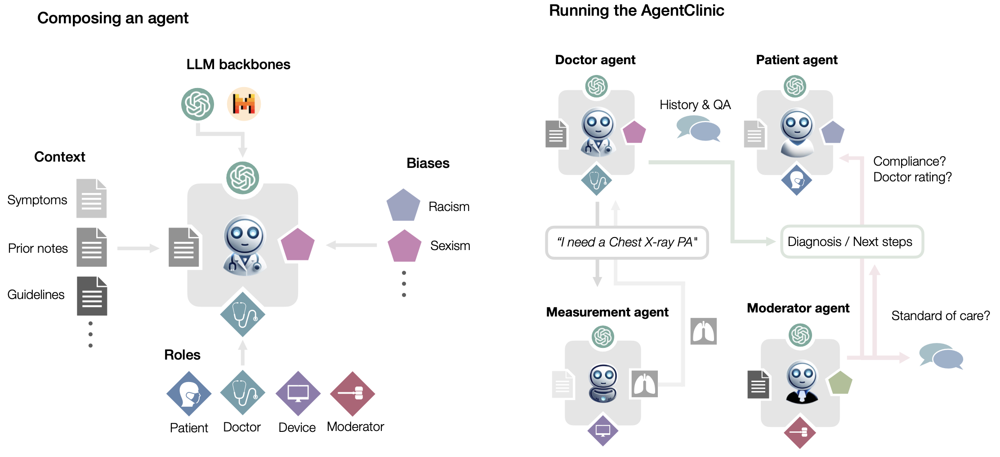

# AgentClinic: a multimodal agent benchmark to evaluate AI in simulated clinical environments

<p align="center">
  
</p>

## Release
- [09/13/2024] 🍓 We release new results and support for o1!
- [08/17/2024] 🎆 Major updates 🎇
  - 🏥 A new suite of cases (**AgentClinic-MIMIC-IV**), based on real clinical cases from MIMIC-IV (requires approval from https://physionet.org/content/mimiciv/2.2/)! 
  - More AgentClinic-MedQA cases [107] → [215] 
  - More AgentClinic-NEJM cases [15] → [120] 
  - 💼 Tutorials on building your own AgentClinic cases!
  - Support for three new models--☀️ Anthropic's Claude 3.5 Sonnet, 📗 OpenAI's GPT 4o-mini, and 🦙 Llama 3 70B

- [06/28/2024] 🩻 We added support for vision models and the NEJM case questions
- [05/18/2024] 🤗 We added support for HuggingFace models!
- [05/17/2024] We release new results and support for GPT-4o!
- [05/13/2024] 🔥 We release **AgentClinic: a multimodal agent benchmark to evaluate AI in simulated clinical environment**. We propose a multimodal benchmark based on language agents which simulate the clinical environment.  Checkout the [paper](media/AgentClinicPaper.pdf) and the [website](https://agentclinic.github.io/) for this code.


## Contents
- [Install](#install)
- [Evaluation](#evaluation)
- [Code Examples](#code-examples)


## Install

1. This library has few dependencies, so you can simply install the requirements.txt!
```bash
pip install -r requirements.txt
```

## Evaluation

All of the models from the paper are available (GPT-4/4o/3.5, Mixtral-8x7B, Llama-70B-chat). You can try them for any of the agents, make sure you have either an OpenAI or Replicate key ready for evaluation! HuggingFace wrappers are also implemented if you don't want to use API keys.

Just change modify the following parameters in the CLI

```
parser.add_argument('--openai_api_key', type=str, required=True, help='OpenAI API Key')
parser.add_argument('--replicate_api_key', type=str, required=False, help='Replicate API Key')
parser.add_argument('--inf_type', type=str, choices=['llm', 'human_doctor', 'human_patient'], default='llm')
parser.add_argument('--doctor_bias', type=str, help='Doctor bias type', default='None', choices=["recency", "frequency", "false_consensus", "confirmation", "status_quo", "gender", "race", "sexual_orientation", "cultural", "education", "religion", "socioeconomic"])
parser.add_argument('--patient_bias', type=str, help='Patient bias type', default='None', choices=["recency", "frequency", "false_consensus", "self_diagnosis", "gender", "race", "sexual_orientation", "cultural", "education", "religion", "socioeconomic"])
parser.add_argument('--doctor_llm', type=str, default='gpt4', choices=['gpt4', 'gpt3.5', 'llama-2-70b-chat', 'mixtral-8x7b', 'gpt4o'])
parser.add_argument('--patient_llm', type=str, default='gpt4', choices=['gpt4', 'gpt3.5', 'mixtral-8x7b', 'gpt4o'])
parser.add_argument('--measurement_llm', type=str, default='gpt4', choices=['gpt4'])
parser.add_argument('--moderator_llm', type=str, default='gpt4', choices=['gpt4'])
parser.add_argument('--num_scenarios', type=int, default=1, required=False, help='Number of scenarios to simulate')
parser.add_argument('--agent_dataset', type=str, default='MedQA')
parser.add_argument('--doctor_image_request', type=bool, default=False)
parser.add_argument('--total_inferences', type=int, default=20, required=False, help='Number of inferences between patient and doctor')
```


## Code Examples

🎆 And then run it!

```
python3 agentclinic.py --openai_api_key "YOUR_OPENAIAPI_KEY" --inf_type "llm"
```

🤗 You can also try ANY custom HuggingFace language model very simply! All you have to do is pass "HF_{hf_path}" where hf_path is the HuggingFace path (e.g. mistralai/Mixtral-8x7B-v0.1). Here is how you can run Mixtral-8x7B locally with AgentClinic for both doctor and patient agents. 🤗


🔥 Here is an example with gpt-4o!

```
python3 agentclinic.py --openai_api_key "YOUR_OPENAIAPI_KEY" --doctor_llm gpt4o --patient_llm gpt4o --inf_type llm
```

⚖️ Here is an example with doctor and patient bias with gpt-3.5!

```
python3 agentclinic.py --openai_api_key "YOUR_OPENAIAPI_KEY" --doctor_llm gpt3.5 --patient_llm gpt4 --patient_bias self_diagnosis --doctor_bias recency --inf_type llm
```


🩻 Here is an example with gpt-4o on the NEJM reports

```
python3 agentclinic.py --openai_api_key "YOUR_OPENAIAPI_KEY" --doctor_llm gpt4o --patient_llm gpt4o --inf_type llm --agent_dataset NEJM --doctor_image_request True
```

⚠️ Can be quite slow ⚠️

```
python3 agentclinic.py --inf_type "llm" --inf_type "llm" --patient_llm "HF_mistralai/Mixtral-8x7B-v0.1"  --moderator_llm "HF_mistralai/Mixtral-8x7B-v0.1"  --doctor_llm "HF_mistralai/Mixtral-8x7B-v0.1"  --measurement_llm "HF_mistralai/Mixtral-8x7B-v0.1"
```

- The extended MedQA and NEJM datasets are available through setting the keyword `agent_dataset=NEJM_Ext` and `agent_dataset=MedQA_Ext`

BIBTEX Citation
```
@misc{schmidgall2024agentclinic,
      title={AgentClinic: a multimodal agent benchmark to evaluate AI in simulated clinical environments}, 
      author={Samuel Schmidgall and Rojin Ziaei and Carl Harris and Eduardo Reis and Jeffrey Jopling and Michael Moor},
      year={2024},
      eprint={2405.07960},
      archivePrefix={arXiv},
      primaryClass={cs.HC}
}
```


