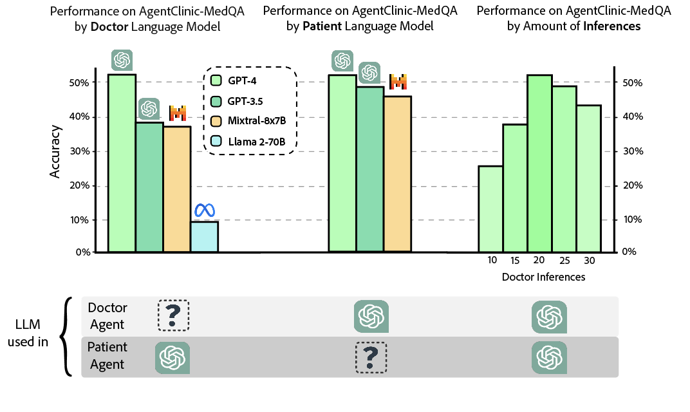

# AgentClinic: a multimodal agent benchmark to evaluate AI in simulated clinical environments


## Release
- [05/XX/2024] 🔥 We release **AgentClinic: a multimodal agent benchmark to evaluate AI in simulated clinical environment**. We propose a multimodal benchmark based on language agents which simulate the clinical environment.  Checkout the [paper](paperlink).


## Contents
- [Install](#install)
- [Evaluation](#evaluation)
- [Evaluating Custom Models](#something)


## Install

1. This library has few dependencies, so you can simply install the requirements.txt!
```bash
pip install -r requirements.txt
```

## Evaluation

Some evaluation instructions here

<p align="center">
  
</p>

### Performance of LLMs on AgentClinic-MedQA


<p align="center">
  
</p>


